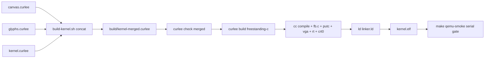

# JOE OS — Phase 2: Agentic Framebuffer OS (Architecture)

Status: Confirmed plan (pre-implementation)
Scope: Refactor the Phase 1 static test kernel into an AI-native, single-address-space
OS with a freestanding software renderer, a 60 FPS event loop, kernel tool APIs for the
LLM agent, and a networked LLM bridge.

---

## 1. Verified compiler constraints (from live experiments)

These were confirmed by running the actual Curlee compiler (`~/Projects/curlee/build/linux-debug/curlee`)
against test files. Every design decision below exists to satisfy them.

| # | Constraint | Evidence | Consequence |
|---|-----------|----------|-------------|
| 1 | `curlee build` (freestanding codegen) **crashes on any `import`** | `std::filesystem` error "cannot make absolute path: Invalid argument []", exit 134, on both our test and Curlee's own `tests/codegen/imported_builtin.curlee` | The codegen input must be a **single self-contained translation unit** (no `import` statements) |
| 2 | `curlee check` / `curlee run` **handle imports fine** (module-qualified calls verified working) | `check` on an imported program succeeds; unknown qualified name produces a clean diagnostic | Pure modules can be multi-file and VM-tested; only the codegen path needs a merged file |
| 3 | Codegen supports **name calls only** — `m.double()` qualified calls are rejected | `codegen.cpp`: "only name calls are supported in freestanding target" | Merged kernel file must call functions by plain name (aliases are resolved at concat time) |
| 4 | **No assignment/rebinding** (`i = tick(i)` is a parse error); no `else if`, `for`, `switch`, `%`, shifts, bitwise ops | Parser diagnostic "expected ';' after expression" | Mutable loop state lives in the **C driver layer**; Curlee is pure math + declarative scene description |
| 5 | `while`, `struct`, `enum`, `Phys<T>`, `extern fn` all codegen correctly | `while_loop.expected`, `struct_fixture.expected`, `phys_mem.expected` | Supported building blocks for the renderer modules |
| 6 | Capability params are **dropped in codegen** (`fn f(pm: cap phys.mem)` → `void curlee_f(void)`) | `codegen.cpp` arg-mirroring logic | The C driver can call `curlee_render_frame()` directly from its own 60 FPS loop |

## 2. Architectural pattern (two layers)

The existing Phase 1 code already embodies the pattern that Phase 2 scales up:

```
┌────────────────────────────────────────────────────────────┐
│ Curlee layer (pure, verified, VM-testable)                 │
│   canvas.curlee  glyphs.curlee  assets.curlee              │
│   • geometry, color math, clipping, layout, ring math      │
│   • NO Phys, NO mutation — proven by Z3, runnable via run  │
├────────────────────────────────────────────────────────────┤
│ Kernel entry (Curlee, single TU for codegen)               │
│   kernel.curlee  (externs + inlined helpers + main)        │
│   • declarative render_frame() scene                       │
│   • calls extern fb_* primitives (no Phys needed in Curlee)│
├────────────────────────────────────────────────────────────┤
│ C driver layer (imperative, owns mutable state)            │
│   fb.c  putc_driver.c  vga_setup.c                         │
│   • owns fb_addr/pitch/width/height, glyph tables,         │
│     frame buffer + ring state                              │
│   • the ONLY layer that touches (volatile) framebuffer     │
└────────────────────────────────────────────────────────────┘
```

**Why not a pure-Curlee blitter?** The blitter needs mutable loop counters and pointer
arithmetic — both rejected by the compiler (constraints #4, #1). The existing `fb.c` /
`fb_draw_char` extern pattern is the proven precedent: Curlee computes *geometry and
intent* (verifiable, testable), C executes *pixels* (fast, imperative). The Curlee
safety contracts (spec item 3) prevent OOB *by construction*: canvas.curlee's pure
`clip_rect`/`rect_contains` validate every rect before it reaches the blitter, and the
C side double-checks bounds as defense-in-depth.

## 3. Target directory structure

```
joeos/
├── Makefile                        # build: merged kernel, iso; verify gates
├── README.md                       # updated with Phase 2 section
├── docs/
│   └── phase2-architecture.md      # this document
├── scripts/
│   ├── find-curlee.sh              # (existing)
│   ├── build_iso.sh                # (existing)
│   ├── vbox-setup.sh               # (existing)
│   └── build-kernel.sh             # NEW: concat modules -> build/kernel-merged.curlee
├── kernel/
│   ├── kernel.curlee               # entry: externs, render_frame demo, main (slim)
│   ├── canvas.curlee               # NEW: pure renderer math (flat-Int color/geometry)
│   ├── glyphs.curlee               # NEW: pure 5x7 glyph math + text layout
│   ├── assets.curlee               # NEW: pure asset/frame-ring math
│   ├── canvas_test.curlee          # NEW: VM test — imports the 3 modules, asserts math
│   ├── pack.curlee                 # (existing, kept)
│   ├── fb.c                        # EXTENDED: pixel/fill_rect/line/text/blit primitives
│   ├── putc_driver.c               # (existing)
│   ├── vga_setup.c                 # (existing)
│   └── boot.S                      # (existing)
```

## 4. Module definitions

> **Verifier-safe API (shipped).** The Curlee verifier rejects struct types in
> function signatures ("unknown type"), division inside contracted functions,
> and calls-as-call-arguments. The shipped modules therefore use **flat `Int`
> components** for rectangles, keep division in **contract-less** helpers
> (asserted by the VM test), and bind call results to `let`s. See §1 for the
> full constraint table. The code below is the actual shipped API.

### 4.1 `kernel/canvas.curlee` — pure renderer math (VM-testable, no main)

Freestanding-safe (Int/Bool only). Defines the geometry vocabulary the blitter
trusts. Contract-carrying functions are Z3-verified; division-based helpers are
contract-less and asserted by the VM test.

```curlee
// Packed 0x00RRGGBB color. Verified: r,g,b in [0,255] -> non-negative Int.
fn rgb(r: Int, g: Int, b: Int) -> Int
  [ requires r >= 0 && r < 256; requires g >= 0 && g < 256;
    requires b >= 0 && b < 256; ensures result >= 0; ] {
  return r * 65536 + g * 256 + b;
}

// Channel extraction (division lives in contract-less helpers).
fn red(c: Int) -> Int   { return c / 65536; }
fn green(c: Int) -> Int { return (c / 256) - (c / 65536) * 256; }
fn blue(c: Int) -> Int  { return c - (c / 256) * 256; }

// True when point (px,py) lies inside rect (x,y,w,h) — half-open edges.
// Verified (flat Int params; no struct in signatures).
fn rect_contains(x: Int, y: Int, w: Int, h: Int, px: Int, py: Int) -> Bool
  [ requires w >= 0 && h >= 0; ensures true; ] {
  if (px >= x && px < x + w && py >= y && py < y + h) {
    return true;
  } else {
    return false;
  }
}

// True when rect a covers rect b (flat Int params). Verified.
fn rect_covers(ax: Int, ay: Int, aw: Int, ah: Int,
               bx: Int, by: Int, bw: Int, bh: Int) -> Bool { ... }

// Clamp v into [lo, hi]. Verified: result in [lo, hi].
fn clamp(v: Int, lo: Int, hi: Int) -> Int
  [ requires lo <= hi;
    ensures result >= lo && result <= hi; ] { ... }

// Clip rect (rx,ry,rw,rh) to bounds (bx,by,bw,bh). Returns the clipped rect
// PACKED as x*2^24 + y*2^16 + w*2^8 + h (0 = empty). Contract-less (packed
// encoding is not Z3-provable); decomposed by clip_x/y/w/h (contract-less).
fn clip_rect(rx: Int, ry: Int, rw: Int, rh: Int,
             bx: Int, by: Int, bw: Int, bh: Int) -> Int { ... }
fn clip_x(r: Int) -> Int { return r / 16777216; }
fn clip_y(r: Int) -> Int { return (r / 65536) - (r / 16777216) * 256; }
fn clip_w(r: Int) -> Int { return (r / 256) - (r / 65536) * 256; }
fn clip_h(r: Int) -> Int { return r - (r / 256) * 256; }

// Alpha blend fg over bg with 0..255 alpha (integer over operator).
// Contract-less (delegates division to blend_channel); asserted by VM test.
fn blend_alpha(fg: Int, bg: Int, alpha: Int) -> Int { ... }
fn blend_channel(fg: Int, bg: Int, alpha: Int) -> Int {
  return (fg * alpha + bg * (255 - alpha)) / 255;
}
```

### 4.2 `kernel/glyphs.curlee` — pure glyph + text layout math

Mirrors the existing 5x7 glyph tables *as pure functions* so text layout is provable,
while `fb.c` keeps the authoritative C tables for pixel drawing. Glyph encoding:
7 rows of 5-bit bitmasks, **bit 4 (0x10) = leftmost pixel** (matches fb.c's tables).

```curlee
// Row bitmask for ASCII ch at glyph row 0..6 (bit 4 = leftmost pixel).
// Unknown chars -> blank row (0). Contract-less (if/else per char).
fn glyph_row(ch: Int, row: Int) -> Int { ... }

// True when the pixel at (col,row) in the 5x7 glyph is set. Division-free
// bit extraction: bits - (bits / (2*value)) * (2*value) >= value, value =
// 16 >> col. Contract-less (division); asserted by the VM test.
fn glyph_pixel(ch: Int, col: Int, row: Int) -> Bool { ... }

// Width of a text run of `len` chars at `scale` (5 cols + 1 advance).
// Contract-less (len * 6 * scale is non-linear for Z3); asserted by VM test.
fn text_width(len: Int, scale: Int) -> Int { ... }

// X offset of char `i` in a text run (advance = 6 * scale). Contract-less.
fn char_x(i: Int, scale: Int) -> Int { ... }

// Height of a glyph at `scale` (7 rows * scale). Contract-less.
fn glyph_height(scale: Int) -> Int { ... }
```

### 4.3 `kernel/assets.curlee` — pure asset & frame-ring math

```curlee
// True when an asset (src_w x src_h) fits at (dst_x,dst_y) on a screen of
// (fb_w x fb_h) after clipping. The blitter's OOB gate.
fn blit_fits(src_w: Int, src_h: Int, dst_x: Int, dst_y: Int,
             fb_w: Int, fb_h: Int) -> Bool { ... }

// Ring-buffer slot math for the video frame buffer:
// next write index after `cur` given `count` slots.
fn ring_next(cur: Int, count: Int) -> Int
  [ requires cur >= 0 && cur < count; requires count > 0; ensures true; ] { ... }

// Byte offset of frame slot `slot` in a ring of `count` frames each of
// `frame_bytes` bytes (count * frame_bytes must fit in the ring).
fn ring_offset(slot: Int, count: Int, frame_bytes: Int) -> Int { ... }
```

### 4.4 `kernel/kernel.curlee` — slim entry (merged into the codegen TU)

Contains: extern declarations, the declarative `render_frame`, and `main`. It does
**NOT** carry inlined helper copies — the merge script (§5) supplies the modules, so
`kernel.curlee` references the helpers by name (they are in scope in the merged file).
`kernel.curlee` alone is not `curlee check`-able standalone; `make check` verifies the
modules + the merged file.

```curlee
extern fn curlee_putc(c: Int) -> Unit;
extern fn curlee_halt() -> Unit;

// fb.c blitter surface (extended in this phase)
extern fn fb_init() -> Unit;
extern fn fb_ready() -> Int;
extern fn fb_clear(color: Int) -> Unit;
extern fn fb_pixel(x: Int, y: Int, color: Int) -> Unit;
extern fn fb_fill_rect(x: Int, y: Int, w: Int, h: Int, color: Int) -> Unit;
extern fn fb_line(x0: Int, y0: Int, x1: Int, y1: Int, color: Int) -> Unit;
extern fn fb_draw_char(ch: Int, x: Int, y: Int, scale: Int) -> Unit;        // Phase-1 compat (orange)
extern fn fb_draw_char_color(ch: Int, x: Int, y: Int, scale: Int, color: Int) -> Unit;
extern fn fb_blit_asset(src: Int, src_w: Int, src_h: Int,
                        dst_x: Int, dst_y: Int) -> Unit;
extern fn fb_present() -> Unit;         // swap/blit to visible surface
extern fn fb_run_loop() -> Unit;        // Phase 2b: ONE loop tick (drain + advance)

// Phase 2b 60 FPS loop control + kernel tool-call queue (fb.c owns the
// mutable state; these externs are Curlee's only window into it).
extern fn fb_loop_init() -> Unit;       // reset frame counter + tool ring
extern fn fb_loop_frame() -> Int;       // current frame counter (loop fuel)
extern fn fb_tool_enqueue(kind: Int, arg: Int) -> Int;  // 1 ok, 0 full
extern fn fb_tool_drained() -> Int;     // intents consumed by last tick
extern fn fb_tool_pending() -> Int;     // intents currently queued

// One frame of the demo scene. Colors are bound to `let`s first (the
// verifier rejects calls as call arguments to other calls). Phase 2b: the
// scene is frame-index-aware — the panel y position alternates between two
// rows via pure Int parity math (no modulo — rejected), proving the loop
// re-renders distinct frames.
fn render_frame(pm: cap phys.mem, frame: Int) -> Unit {
  let bg: Int = rgb(8, 8, 12);
  let panel: Int = rgb(220, 80, 40);
  let line: Int = rgb(40, 220, 80);
  let white: Int = rgb(255, 255, 255);
  fb_clear(bg);
  let panel_parity: Int = frame - (frame / 2) * 2;  // 0 or 1 (no % operator)
  let panel_y: Int = 40 + panel_parity * 60;
  fb_fill_rect(40, panel_y, 200, 120, panel);
  fb_line(40, 170, 240, 170, line);
  fb_draw_char_color(74, 60, 60, 4, white);   // J
  fb_draw_char_color(79, 96, 60, 4, white);   // O
  fb_draw_char_color(69, 132, 60, 4, white);  // E
  fb_present();
  return;
}

fn main(pm: cap phys.mem) -> Unit {
  fb_init();
  if (fb_ready() == 1) {
    // Phase 2b: Curlee's main DRIVES the deterministic 60 FPS loop (it is
    // the one exported symbol — codegen emits every other fn `static`, so
    // fb.c cannot call curlee_render_frame). The C driver owns the mutable
    // frame counter + tool ring; this while-loop is the fuel bound.
    fb_loop_init();
    while (fb_loop_frame() < 4) {
      let f: Int = fb_loop_frame();
      render_frame(pm, f);
      serial_frame_marker(f);   // FR:<n> (qemu-loop-smoke gate)
      fb_run_loop();            // drain tool ring + advance counter
    }
    serial_fb_marker();         // FB: 1 (qemu-fb-smoke gate)
  } else {
    vga_text_setup();
  }
  // VGA text fallback + serial (the Phase 1 acceptance path) ...
  serial_hello();
  curlee_halt();
  return;
}
```

### 4.5 `kernel/fb.c` — extended blitter (C driver, owns state)

Extends the existing glyph renderer with a full primitive surface. All functions
bounds-check against `fb_width`/`fb_height` (defense-in-depth over Curlee geometry).

```c
void fb_clear(long long color);                    // fill whole FB
void fb_pixel(long long x, long long y, long long color);
void fb_fill_rect(long long x, long long y, long long w, long long h, long long color);
void fb_line(long long x0, long long y0, long long x1, long long y1, long long color);
void fb_draw_char(long long ch, long long x, long long y, long long scale); // Phase-1 compat (orange)
void fb_draw_char_color(long long ch, long long x, long long y, long long scale,
                        long long color);         // 5x7 glyphs, requested color
void fb_blit_asset(long long src, long long src_w, long long src_h,
                   long long dst_x, long long dst_y);  // 32bpp RAW source buffer
void fb_present(void);                             // no-op stub until double-buffering lands

// Phase 2b 60 FPS event loop + kernel tool-call queue (fb.c owns the state):
long long fb_loop_init(void);     // reset frame counter + tool ring
long long fb_loop_frame(void);    // current frame counter (loop fuel)
long long fb_tool_enqueue(long long kind, long long arg);  // 1 ok, 0 full
long long fb_tool_drained(void);  // intents consumed by the last tick
long long fb_tool_pending(void);  // intents currently queued
void fb_run_loop(void);           // ONE tick: drain the tool ring + advance frame
```

**Phase 2b loop ownership**: the freestanding codegen emits every non-`main`
function with `static` linkage (verified in `build/kernel.c`:
`static void curlee_render_frame(...)`), so a separate TU like `fb.c` **cannot**
call `curlee_render_frame`. Curlee's `main` is the one exported symbol and
therefore **drives the deterministic while-loop**; `fb.c` owns the mutable frame
counter and the fixed-slot tool ring (a static array, no malloc), exposing them
through the externs above. Per frame, `main` reads `fb_loop_frame()`, renders,
emits `FR:<n>`, then calls `fb_run_loop()` to drain the ring and advance. The
loop is fuel-bounded in Curlee (`while (fb_loop_frame() < 4)`), so the smoke
gates stay deterministic and timeout-safe.

Note: `fb_init()` stays a no-op until the multiboot2 framebuffer address is exposed
to the kernel (Phase 1 limitation). The blitter is fully written and unit-testable in
QEMU via the VGA fallback path once the framebuffer lands; until then the demo scene
is verified statically + the serial smoke gate still passes.

## 5. Build & verification pipeline

The codegen crash (constraint #1) is solved by **build-time concatenation**: modules
stay separate for humans and VM tests, and a script emits the single-TU file the
codegen requires. This also future-proofs: when the Curlee import bug is fixed (§8),
`build-kernel.sh` can be deleted and `kernel.curlee` becomes a true importer.



New/changed Makefile targets:

| Target | Action |
|--------|--------|
| `make kernel` | run `build-kernel.sh`, `check` merged file, codegen, compile, link → `build/kernel.elf` |
| `make canvas-run` | `curlee run kernel/canvas_test.curlee` (imports canvas/glyphs/assets + asserts pure math) |
| `make check` | `curlee check` each pure module (pack, canvas, glyphs, assets) + `curlee check` merged kernel |
| `make verify` | `check` + `pack-run` + `canvas-run` + `kernel` + ELF/`_start`/`curlee_main`/PVH gates |
| `make qemu-smoke` | unchanged acceptance gate (serial contains "Hello World from JOE") |

`scripts/build-kernel.sh` responsibilities (deterministic, ~40 lines):
1. Concatenate `canvas.curlee` + `glyphs.curlee` + `assets.curlee` + `kernel.curlee`
   in dependency order into `build/kernel-merged.curlee` (single SPDX header kept).
2. Strip nothing else — pure modules contain **no `main`** (their tests live in
   `kernel/canvas_test.curlee`), so there is exactly one `main` in the merged file.
3. Fail loudly if any fragment contains `import` (protects against constraint #1).

## 6. No-duplication sync policy (revised)

`kernel.curlee` is a **slim entry**: externs + `render_frame` scene + `main` + `vga_cell`.
It does NOT carry inlined copies of the pure helpers — the merge script supplies them
from the modules. This eliminates the drift risk entirely:

- The pure modules (`canvas.curlee` / `glyphs.curlee` / `assets.curlee`) are the single
  source of truth for the math.
- `kernel.curlee` calls those helpers by name; at merge time they are in scope.
- `make verify` runs `curlee run kernel/canvas_test.curlee` on the **module**
  definitions — the authoritative correctness gate for the math.
- `kernel.curlee` alone is not `curlee check`-able standalone (it references module
  helpers); `make check` verifies the modules + the merged file, which is the codegen
  input.
- When the Curlee codegen import fix lands (§8), `kernel.curlee` becomes a true
  importer and `build-kernel.sh` is deleted.

## 7. Phased roadmap (spec targets → work items)

| Phase | Spec target | Status |
|-------|-------------|--------|
| 2a | Software renderer: blitter primitives, text, bitmap/frame blit (THIS SESSION) | ✅ DONE — canvas/glyphs/assets modules (VM-verified), fb.c blitter extensions, merge pipeline, demo scene; all gates pass |
| 2b | Kernel tool API & 60 FPS event loop | ✅ DONE — Curlee `main` drives the deterministic, fuel-bounded while-loop (4 frames); `fb.c` owns the frame counter + fixed-slot tool ring (no malloc); per-frame `FR:<n>` serial markers; `make qemu-loop-smoke` asserts frames 0..2+ |
| 2c | Memory & asset management contracts | ✅ DONE — static asset region (128x128) + 2-slot 640x480 frame ring (fb.c, no malloc); every blit/fill/line/text path gated by verified pure gates (rect_fits_gate/line_fits_gate/char_fits_gate/asset_blit_fits) reading runtime FB size from extern accessors; `fb_present()` performs a REAL flip on the GRUB framebuffer path (`RING: 1` in serial, asserted by qemu-fb-smoke/qemu-loop-smoke); PVH path compiles the ring out (`JOE_PVH_BOOT`) because QEMU's PVH loader rejects ELFs with a large BSS (verified empirically — see fb.c header); all gates green |
| 2d | LLM bridge (VirtIO-net / TCP + JSON) | Host-side llama.cpp HTTP; kernel JSON module (pure parser, single TU) + net driver in C; out of current scope — needs a NIC driver first |
| 2e | Framebuffer address plumbing | ✅ DONE — Phase 2e groundwork (mb2.c parser, fb.c blitter, qemu-fb-smoke gate) + **Phase 2e-2** (32-bit multiboot2 entry + framebuffer request tag): `make qemu-fb-smoke` PASSES, serial `FB: 1` proves `fb_ready()==1` under QEMU/VirtualBox |
| 2f | PVH/VBE framebuffer fallback | ⏳ OPEN — the QEMU `-kernel` (PVH) path has no multiboot2 info, so `fb_ready()` stays 0 there and it falls back to VGA text. A VBE/EDID probe in the C driver (or `qemu -kernel` with a real framebuffer) would activate the renderer on that path too. See `docs/phase2e-2-report.md` §5 |

## 8. Open items (Curlee repo — recommended follow-up)

- **Fix codegen import crash**: `curlee build` throws `std::filesystem::filesystem_error`
  on programs with `import` (reproduced with Curlee's own `tests/codegen/imported_builtin.curlee`).
  Likely culprit: `normalize_path`/`load_import` path handling in
  [`cli_impl.ipp`](../curlee/src/cli/cli_impl.ipp:770) when the entry file path is not
  absolute for the codegen path. Fixing this lets `kernel.curlee` import
  `canvas.curlee`/`glyphs.curlee` natively and deletes `build-kernel.sh`.
- This is a separate work item in `~/Projects/curlee` (issue-gated per its repo policy);
  not required to ship Phase 2a.

## 9. Acceptance criteria (Phase 2a)

1. `make check` passes: every pure module + the merged kernel verify (Z3) clean. ✅
2. `make canvas-run` passes: `curlee run kernel/canvas_test.curlee` asserts
   `rgb(255,0,0) == 16711680`, `rect_contains` truth table, `clip_rect` edge cases,
   `ring_next` wrap, `blit_fits` OOB rejection → returns 0. ✅
3. `make kernel` builds `build/kernel.elf` from the merged single TU. ✅
4. `make qemu-smoke` still passes (serial acceptance gate unchanged — the framebuffer
   demo scene is statically verified; `fb_init` no-op keeps the VGA fallback working). ✅
5. `docs/phase2-architecture.md` + README Phase 2 section describe the full roadmap
   (2a–2e) and the build pipeline. ✅

All five criteria verified on this branch.

## 10. Acceptance criteria (Phase 2b)

1. `make check` + `make canvas-run` pass: the pure tool-queue geometry
   (`tool_queue_slots`/`tool_slot_bytes`/`tool_slot_offset`/`tool_slot_valid`/
   `tool_ring_next`) is verified and VM-asserted (canvas_test.curlee §12). ✅
2. `make kernel` + `make verify` pass: the 64-bit PVH path is unchanged. ✅
3. `make qemu-fb-smoke` passes: the framebuffer loop path still emits `FB: 1`. ✅
4. NEW `make qemu-loop-smoke` passes: serial contains `FR:0`, `FR:1`, `FR:2`
   — the loop rendered >1 frame deterministically and halted within the
   timeout. ✅
5. `make qemu-smoke` passes: the PVH/VGA fallback (`fb_ready()==0`) is
   unchanged. ✅
6. Tool-call queue: the ring math from `assets.curlee` is consumed by `fb.c`
   (`TOOL_QUEUE_SLOTS`/`TOOL_SLOT_BYTES`/`tool_queue`), producers/consumers
   documented, no malloc. ✅

All six criteria verified (see `docs/phase2-report.md` Phase 2b section).

## 11. Acceptance criteria (Phase 2c — memory & asset management contracts)

1. `make canvas-run` passes with the extended ring/blit assertions
   (canvas_test.curlee §14–§17: static asset region geometry, 2-slot 640x480
   frame ring geometry, rect/line/char/asset-blit gates). ✅
2. Every blit/fill/line/text path in `render_frame` is gated by BOTH the
   Curlee verified pure gate (rect_fits_gate / line_fits_gate /
   char_fits_gate, reading the runtime FB size from `fb_get_width`/
   `fb_get_height`) AND the C bounds check in fb.c — a deliberately
   out-of-bounds primitive is skipped (never a partial write). ✅
3. `make qemu-fb-smoke` passes and now ALSO asserts `RING: 1` — the frame
   ring activated and `fb_present()` performed a real back-buffer flip on the
   GRUB 640x480 framebuffer path. ✅
4. `make qemu-loop-smoke` passes with the full ordered sequence
   `FR:0..FR:3, RING: 1, FB: 1, Hello World from JOE!`. ✅
5. `make verify` + `make qemu-smoke` still pass (PVH path unchanged — the
   ring/asset region are compiled out via `JOE_PVH_BOOT` because QEMU's PVH
   loader rejects ELFs with a large BSS, verified empirically; see fb.c). ✅
6. No malloc/libc anywhere; all buffers are static arrays (asset_region,
   frame_ring, tool_queue) with size-validated geometry cross-checked by the
   VM test. ✅

All six criteria verified (see `docs/phase2e-2-report.md` and the code).
