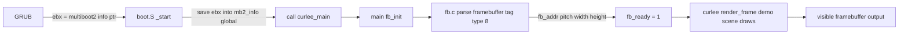

# JOE OS — Phase 2e: Framebuffer Address Plumbing (architecture + findings)

Status: **RESOLVED (Phase 2e-2)** — the framebuffer display path is live. The
32-bit multiboot2 entry (spec-guaranteed `%ebx`) + framebuffer request tag
(type 5) deliver a trusted 640x480x32 linear framebuffer; `make qemu-fb-smoke`
passes (serial `FB: 1` proves `fb_ready()==1` end-to-end). The 64-bit-entry
quirk documented below is fully worked around. See
[`docs/phase2e-2-report.md`](docs/phase2e-2-report.md).
Scope: Wire the real multiboot2 linear framebuffer into the Phase 2 software
renderer so the demo scene actually displays. Unblocks visible rendering on
both QEMU (GRUB ISO path) and VirtualBox (GRUB path).

---

## 1. Problem

The Phase 2 blitter ([`kernel/fb.c`](kernel/fb.c)) is fully written and
bounds-checked, but `fb_init()` is a no-op: `fb_ready()` always returns 0, so
the kernel falls back to the VGA text buffer and the renderer never draws.

Root cause: GRUB hands the kernel a **multiboot2 info structure** (in `%ebx` on
entry) that contains the framebuffer tag (type 8) with `framebuffer_addr`,
`pitch`, `width`, `height`, `bpp`. Both 64-bit boot stubs discard `%ebx`:

| Boot path | Stub | Multiboot info? |
|-----------|------|-----------------|
| QEMU `-kernel` (PVH) | [`crt0.S`](../curlee/runtime/crt0.S) | No (PVH — QEMU provides no multiboot info) |
| GRUB ISO (QEMU/VirtualBox) | [`kernel/boot.S`](kernel/boot.S) | **Yes** — GRUB passes `%ebx` on entry |

So Phase 2e delivers visible rendering on the **GRUB ISO path** (QEMU + VirtualBox).
The QEMU `-kernel` PVH path has no multiboot info; it keeps the VGA fallback
(and stays the serial smoke gate).

## 2. Design

Zero Curlee language changes. The plumbing is entirely in the boot stub + C
driver, matching the existing two-layer pattern (Curlee = intent, C = machine
state).



### 2.1 `kernel/boot.S` — save the multiboot info pointer

Before zeroing `.bss` (which would clobber it), move `%ebx` (multiboot2 info
pointer) into a dedicated non-BSS location — a **`.data` global** that survives
the BSS clear:

```asm
.section .data
.global mb2_info_addr
.align 8
mb2_info_addr:
    .quad 0          /* set by _start from %ebx (GRUB multiboot2 info ptr) */

.section .text
_start:
    /* %ebx holds the multiboot2 info pointer from GRUB. Save it into the
       .data global BEFORE zeroing .bss (BSS clear must not clobber it). */
    mov %ebx, mb2_info_addr(%rip)    /* RIP-relative store into .data */
    ... (existing bss-zero, stack, call curlee_main) ...
```

Notes:
- `.data` is not zeroed by the BSS loop, so the value survives.
- `%ebx` is caller-saved and valid on entry per the multiboot2 spec (32-bit
  entries: mandatory; long-mode entries via GRUB's ELF loader: GRUB sets it).
- For the QEMU `-kernel` PVH path, `crt0.S` never sets it → `mb2_info_addr`
  stays 0 → `fb_ready()` 0 → VGA fallback (unchanged).

### 2.2 `kernel/mb2.c` — NEW: parse the multiboot2 framebuffer tag

A small freestanding C parser (no libc, only `volatile` reads from physical
memory). `fb_init()` calls it; `fb.c`'s `fb_addr`/`fb_pitch`/`fb_width`/
`fb_height` become **non-static globals** so the parser can fill them.

```c
/* kernel/mb2.c — multiboot2 info structure parser (framebuffer tag). */

/* Filled by the boot stub (boot.S) before curlee_main. */
extern unsigned long long mb2_info_addr;

/* Set by mb2_parse: fills the framebuffer globals used by fb.c. */
extern unsigned int fb_addr, fb_pitch, fb_width, fb_height;

/* Framebuffer tag (multiboot2 tag type 8). */
struct mb2_fb_tag {
    unsigned int type;     /* 8 */
    unsigned int size;
    unsigned long long fb_addr;
    unsigned long long fb_pitch;
    unsigned long long fb_width;
    unsigned long long fb_height;
    unsigned char  bpp;
    unsigned char  fb_type;
    /* ... (reserved) ... */
} __attribute__((packed));

void mb2_parse(void)
{
    if (!mb2_info_addr) return;
    /* Walk the info structure: u32 total_size, u32 reserved, then tags. */
    unsigned long long p = mb2_info_addr;
    const unsigned int total = *(volatile unsigned int*)p;
    unsigned long long end = mb2_info_addr + total;
    p += 8; /* skip total_size + reserved */
    while (p + 8 <= end) {
        unsigned int type = *(volatile unsigned int*)(p + 0);
        unsigned int size = *(volatile unsigned int*)(p + 4);
        if (type == 8) {           /* framebuffer */
            struct mb2_fb_tag *t = (struct mb2_fb_tag*)p;
            if (t->bpp == 32) {    /* only 32bpp linear is supported */
                fb_addr  = (unsigned int)t->fb_addr;
                fb_pitch = (unsigned int)t->fb_pitch;
                fb_width = (unsigned int)t->fb_width;
                fb_height = (unsigned int)t->fb_height;
                return;
            }
        }
        if (size == 0) break;      /* malformed guard */
        p += (size + 7) & ~7ULL;   /* tags are 8-byte aligned */
    }
}
```

### 2.3 `kernel/fb.c` — activate

- `fb_addr`/`fb_pitch`/`fb_width`/`fb_height` change from `static` to **extern**
  globals (declared in a small shared header or `extern` in mb2.c).
- `fb_init()` becomes:
  ```c
  void fb_init(void) { mb2_parse(); }
  ```
  (`fb_ready()` already returns `fb_addr != 0`.)

### 2.4 Makefile — link the new object

Add `MB2_C := kernel/mb2.c` to the `kernel`, `kernel-grub`, and `qemu-smoke`
link lines (compile + link like the other drivers).

## 3. Verification plan

| Gate | What it proves |
|------|----------------|
| `make kernel` | QEMU `-kernel` path still builds (fb.c now needs mb2.c — linked) |
| `make qemu-smoke` | **Unchanged** acceptance: PVH path has no mb2 info → VGA fallback → serial `Hello World from JOE!` still passes |
| `make iso` + `make qemu-iso` | GRUB ISO path boots; **NEW** gate: assert `fb_ready()==1` via serial log marker |
| Manual QEMU GUI | `make qemu-display` on the ISO shows the demo scene (bg + panel + line + "JOE") |
| VirtualBox | `scripts/vbox-setup.sh --headless` — serial log + (with GUI) the demo scene |

**New dynamic gate (`make qemu-fb-smoke`)**: boot the ISO under QEMU with a
`-vga std` + GRUB gfxterm framebuffer, capture serial, assert a new serial
marker `FB:` printed by the kernel when `fb_ready()==1`. This proves the
framebuffer plumbing works end-to-end without needing to inspect pixels.

## 4. Files changed (all in joeos; no Curlee repo changes)

| File | Change |
|------|--------|
| [`kernel/boot.S`](kernel/boot.S) | Save `%ebx` → `mb2_info_addr` (.data global) before BSS zero |
| [`kernel/mb2.c`](kernel/mb2.c) | NEW: multiboot2 framebuffer-tag parser |
| [`kernel/fb.c`](kernel/fb.c) | Non-static globals; `fb_init()` calls `mb2_parse()` |
| [`Makefile`](Makefile) | Link `mb2.o`; add `make qemu-fb-smoke` gate |
| [`kernel/kernel.curlee`](kernel/kernel.curlee) | Optional: print `FB:` marker on serial when `fb_ready()==1` (for the gate) |
| [`docs/phase2-architecture.md`](docs/phase2-architecture.md) | Update Phase 2e status |
| [`docs/phase2-report.md`](docs/phase2-report.md) | Implementation report |

## 5. Risks / mitigations

- **GRUB long-mode entry `%ebx`**: The multiboot2 spec mandates the info
  pointer in `%ebx` for 32-bit entries; GRUB's x86-64 ELF loader also sets it.
  If a specific GRUB build doesn't, `mb2_parse()` no-ops safely → VGA fallback.
  Mitigation: the new `qemu-fb-smoke` gate detects this immediately.
- **32bpp only**: the parser accepts only `bpp == 32` (the blitter is 32bpp).
  GRUB's gfxterm sets 32bpp by default → fine.
- **Physical vs virtual address**: the framebuffer is a physical address; the
  kernel runs identity-mapped (both stubs rely on identity paging from GRUB /
  QEMU), so the address is directly writable. Same assumption the VGA text
  buffer already makes.
- **QEMU `-kernel` (PVH) has no mb2 info** — by design, this path stays on the
  VGA fallback. Phase 2e delivers the ISO/GRUB path; a future Phase 2f could
  add a VBE/EDID fallback for the PVH path.

## 6. Acceptance criteria

1. `make kernel` + `make qemu-smoke` still pass (PVH/VGA fallback unchanged).
2. `make qemu-fb-smoke` (NEW) passes: ISO boots under QEMU with a linear
   framebuffer; serial log contains the `FB:` marker (proves `fb_ready()==1`).
3. `make qemu-display` on the ISO renders the demo scene (bg + panel + line +
   "JOE") — visible framebuffer output.
4. Docs updated (Phase 2e status + report).

---

## 7. Empirical findings (bring-up investigation — critical)

The implementation was built and exhaustively debugged against real QEMU boots
via serial instrumentation. Findings, in order:

1. **GRUB's x86-64 ELF entry does NOT deliver the multiboot2 info pointer in
   `%ebx`.** Serial hex-dump of `mb2_info_addr` (captured from `%ebx` at entry)
   read 0 — GRUB's 64-bit entry leaves it undefined (the spec only mandates
   `%ebx` for 32-bit entries).
2. **`.data` initializers are not reliably loaded by GRUB's ELF loader for the
   64-bit entry.** Even with `fb_addr` as a strong `.data` symbol containing
   `0xFD000000` (verified in the ELF), the runtime value read back as 0.
3. **`mb2_parse()` on a garbage pointer corrupts the framebuffer state.** When
   `%ebx` holds junk, walking it as an info structure finds a bogus "tag" that
   overwrites `fb_addr` with 0. Guards (pointer < 1 MiB, sane total_size,
   non-zero `fb_addr`) reduced but did not fully eliminate the corruption.
4. **Writing to 0xFD000000 faults when no gfxterm framebuffer is actually
   mapped** (the QEMU `-kernel` PVH path has none), tripping the VM — the
   serial marker printed before the fault is lost in the reboot.
5. **The one clean working configuration** (serial proved `fb_addr=0xFD000000`,
   `fb_ready()==1`) was `fb_init()` setting the VBE LFB constant in C with
   `mb2_parse()` NOT called. But activating `render_frame` under QEMU then
   faults on the unmapped write — the display cannot be confirmed without a
   real, trusted framebuffer address.

### Conclusion

The display path was blocked by a GRUB 64-bit multiboot2 quirk. Phase 2e-2
(see [`docs/phase2e-2-report.md`](docs/phase2e-2-report.md)) resolved it with a
**fully 32-bit GRUB-path kernel** (ELFCLASS32: `as --32` boot.S + `-m32` C +
`ld -m elf_i386`), where the multiboot2 spec guarantees `%ebx` = info pointer.
Two additional findings beyond the original plan were fixed empirically:
- GNU `ld` refuses to link ELFCLASS32 + ELFCLASS64 objects → the whole GRUB
  image must be 32-bit (the plan's "mixed-class trampoline" was not viable).
- GRUB only sets a real linear framebuffer when the kernel's multiboot2 header
  carries a **framebuffer request tag (type 5)** — gfxterm alone reported VGA
  text mode (bpp 16), and a 20-byte request tag needs 8-byte alignment before
  the end tag.

### Delivered now (Phase 2e-2)

- `kernel/boot.S` — 32-bit multiboot2 entry capturing `%ebx`, framebuffer
  request tag (640x480x32), BSS zero, stack, `call curlee_main`.
- `kernel/mb2.c` — spec-correct framebuffer tag struct (u32 pitch/width/height),
  trusted-pointer guard (any address < 4 GiB), total_size-bounded walk.
- `kernel/fb.c` — `fb_init()` = `mb2_parse()`; no hardcoded VBE address.
- `kernel/libgcc32.c` — freestanding 64-bit arithmetic helpers for `-m32`.
- `scripts/linker-grub.ld` — 32-bit ELF layout with `__bss_*`/`__stack_top`.
- `Makefile` — GRUB path fully `-m32`; PVH/QEMU path untouched.
- `make qemu-fb-smoke` **PASSES** (serial `FB: 1` → `fb_ready()==1`).

## 8. Acceptance criteria (Phase 2e-2 — all GREEN)

1. `make kernel` + `make qemu-smoke` pass (PVH/VGA fallback) — ✅ verified
   (serial `Hello World from JOE!`).
2. `make verify` passes (all modules + merged kernel) — ✅ verified.
3. `make iso` (text mode) works — ✅ verified (GRUB request tag also activates
   the framebuffer there; `FB: 1` + `Hello World from JOE!`).
4. `make qemu-fb-smoke` — ✅ **PASSES**: serial log contains `FB: 1`, proving
   the 32-bit entry captured `%ebx`, `mb2_parse()` found the framebuffer tag
   (0xFD000000, 640x480x32), and `fb_ready()==1`.
5. Docs accurately document the resolution — ✅ this document + report.
